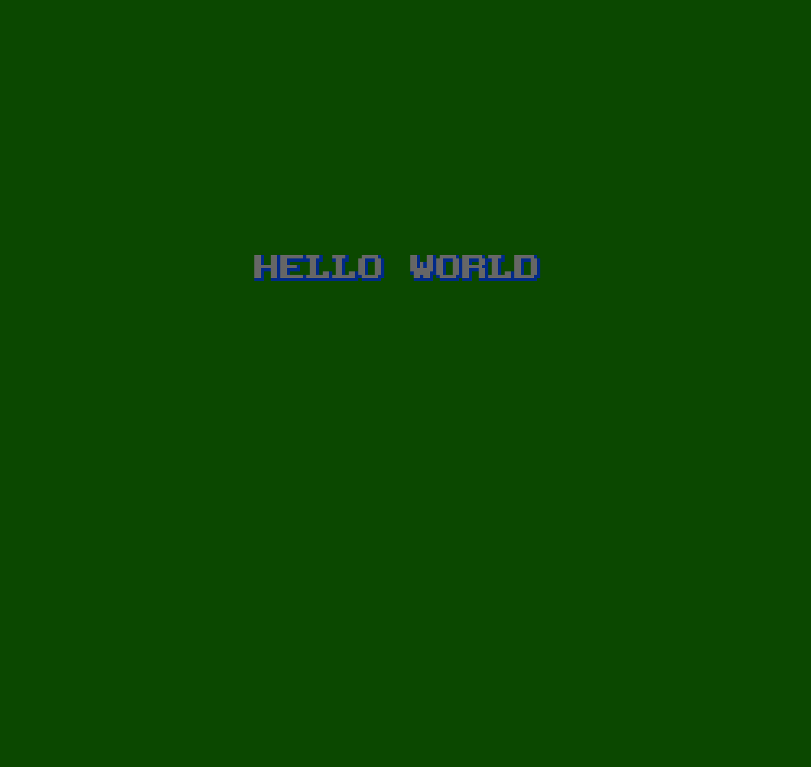

# cc65 Hello World Sample

cc65(ファミコン)向けの「HELLO WORLD」サンプルプログラムです。  
6502 CPU + PPU に直接アクセスして、背景タイルに文字列を表示し、コントローラ入力でスクロールします。

---

## 機能概要

- PPUの初期化
- 背景タイルへの文字列書き込み
- NMI 割り込みによる VBlank 同期
- コントローラ入力によるスクロール制御

---

## ビルド方法

このプロジェクトは [cc65](https://cc65.github.io/) を使用しています。  
1. CC65 を C:\cc65 にインストールしてください。
2. コマンドプロンプトを開き、リポジトリのルートフォルダに移動します。
3. 以下のコマンドを実行してビルドします。

    `make`

4. ビルドが成功すると、build フォルダに cc65-helloworld.nes が生成されます。

    ⚠️CC65 を別の場所にインストールしている場合は、Makefile の CC65_PATH を環境に合わせて変更してください。

## 実行方法

生成された .nes ファイルをお好みの NESエミュレーターで起動してください。  
例: FCEUX, Mesen

## ライセンス

このリポジトリのソースコードおよびアセットは CC0 1.0 Universal の下で提供されます。  
自由に使用・改変・再配布が可能です。詳細は LICENSE を参照してください。

## スクリーンショット

